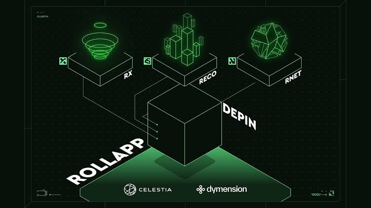

## RIVALZ NETWORK BOT



This repository contains a bot for interacting with the Rivalz Fragmentz claimer using Ethereum wallets.

## Features

- Check wallet balances
- Claim Fragmentz
- One-time claim
- Recurring claim every 12 hours
- Interactive CLI interface

### Prerequisites

- Node.js (version 16 or higher)
- npm (Node Package Manager)

### Installation

1. Clone the repository:

   ```bash
   git clone https://github.com/Rambeboy/rivalz-network-bot.git && cd rivalz-network-bot
   ```

2. Install dependencies:

   ```bash
   npm install
   ```
   
3. Configure your accounts
   ```bash
   cp -r accounts/privateKeys.js privateKeys.js && cp -r accounts/accounts.js accounts.js
   ```

### Setup Wallets

You need to provide your Ethereum private keys or mnemonics in either `privateKeys.js` or `accounts.js` in the following formats:

- For private keys (array of strings):

  ```json
  [
    "private_key_1",
    "private_key_2"
  ]
  ```

- For mnemonics (array of strings):

  ```json
  [
    "banana apple boat monkey",
    "chicken dog cat ball"
  ]
  ```

### Usage

To start the bot, run:

```bash
npm run start
```

#### Options

1. **Check Balances**: Enter `0` to check the balance of each wallet.
2. **Claim Fragmentz**: Enter `1` to claim Fragmentz.
- **One-time Claim**: Enter `1` to claim once.
- **Recurring Claim**: Enter `2` to perform an initial claim and set up a recurring job that runs every 12 hours.

## License

This project is licensed under the MIT License. See the [LICENSE](LICENSE) file for detail.
